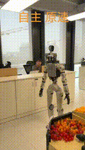
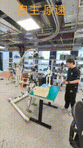
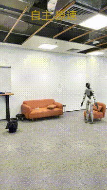

# HFSF-VLA: High-Frequency Full-Humanoid Control via Slow-Fast Flow Matching

Welcome to the official repository for our work on high-frequency, dynamic full-humanoid robot control.

> 📢 **Status:** 🚧 Work in Preparation for ICLR 2027 | Code & Models Coming Soon 🚧

## 📖 About The Project

This repository introduces a novel Vision-Language-Action (VLA) paradigm designed to overcome the kinematic bottlenecks in highly dynamic full-humanoid robot control. Generating policies based on flow matching models has been shown to be effective, particularly in robotic manipulation tasks. However, directly predicting joint angles often leads to physical tremors and planning latency. 

To resolve this, we propose a slow-fast architecture that outputs the hidden variables of a downstream motor control foundation model rather than raw kinematics.

## ✨ Key Contributions & Features

*   **Frequency-Sorted DCT-FSQ Tokenization:** We encode the continuous latent space using a Discrete Cosine Transform and Finite Scalar Quantization (DCT-FSQ) scheme. By strictly sorting these tokens from low to high frequency, we naturally enforce a coarse-to-fine decoding hierarchy that perfectly balances autoregressive generation speed with precise motion recovery.
*   **Slow-Fast Cascaded Inference:**
    *   **Slow Step:** Focuses on deep semantic reasoning and plans global macroscopic motion.
    *   **Fast Step:** Directly reuses the Slow step's visual and semantic KV cache to eliminate computational redundancy.
*   **40Hz Real-Time Flow Matching:** By integrating a lightweight Flow Matching model into the Fast step, we push the inference and control frequency up to 40Hz. This enables real-time environmental perception and dynamic updates to the high-frequency FSQ tokens, significantly outperforming existing state-of-the-art models in complex humanoid tasks.

## 🎥 Demo Gallery

Below are three demonstrations showcasing the demo of our VLA model on full-humanoid hardware:

### 1. Dynamic Locomotion & Manipulation

### 2. Clean_table

### 3. Tidying up the house

## 🚀 Open Source Roadmap

We are currently refining the codebase for our upcoming ICLR 2027 submission. We are committed to the open-source robotics community and plan to release the following components:

- [ ] **Pre-trained Models:** Checkpoints for the Slow-Fast VLA and the Cerebellar Foundation Model.
- [ ] **Training Code:** Scripts for DCT-FSQ tokenization and flow matching policy training.
- [ ] **Evaluation Suite:** Simulation environments and hardware deployment guides.

---
Please ⭐ **Star** this repository to stay updated on our release progress!
